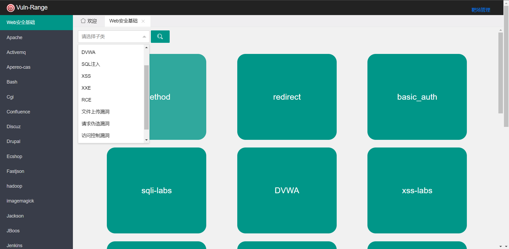

> **VulnRange的定位是一个漏洞靶场，用于快速的启动漏洞环境，便于漏洞复现和研究**

使用VulnRange可以快速的部署含有未修复漏洞的Shiro和S2等第三方组件的测试环境，方便复现漏洞。

# 安装部署🚀

## 注意事项

> 1. 项目需要放到 `~/`  当前用户目录下
> 2. ubuntu 需要将`start.sh`中的`~/`改为绝对路径，如`/home/ubuntu`
> 3. 关闭Linux防火墙后请重启docker
> 4. python使用python3.8以上版本
> 5. 不建议部署在VPS上，小心被人GetShell

## 环境配置

**以Centos为例**

1、Centos安装python3.8和PIP

```bash
#安装python3.8
yum -y install yum-utils
yum-builddep python
curl -O https://www.python.org/ftp/python/3.8.0/Python-3.8.0.tgz
tar xf Python-3.8.0.tgz
cd Python-3.8.0
./configure
make
make install

#设置python3.8为默认版本
vi /etc/profile.d/python.sh         #编辑用户自定义配置，输入alias参数
alias python='/usr/local/bin/python3.8'　　#这里写你的python路径
source /etc/profile.d/python.sh     #重启会话使配置生效

#安装pip
wget https://bootstrap.pypa.io/get-pip.py
python get-pip.py -i https://pypi.tuna.tsinghua.edu.cn/simple/
```

2、安装docker和docker-compose [把docker源换掉，推荐阿里云的源]

```bash
#安装docker
yum install -y yum-utils	# yum-config-manager需要用这个包
yum-config-manager --add-repo https://download.docker.com/linux/centos/docker-ce.repo	#安装docker官方源
yum makecache
yum -y install docker-ce
systemctl start docker

#安装docker-compose
pip install docker-compose -i https://pypi.mirrors.ustc.edu.cn/simple/
```

更换阿里源：[阿里云帮助手册](https://help.aliyun.com/document_detail/60750.html?spm=a2c4g.11186623.6.553.4851242foO76sC)，用淘宝账号登陆后获取一个独有的加速地址

3、关闭防火墙和SELinux

```bash
firewall-cmd --state				#查看防火墙状态
systemctl stop firewall.service		#停止防火墙
systemctl disable firewall.service	#禁止开机启动

vim /etc/selinux/config/  
#修改为以下内容
SELINUX=disabled

#然后最好重启一下系统
```

## 下载安装VulnRange

```bash
git clone https://github.com/wgpsec/VulnRange.git
cd VulnRange
pip install -e . -i https://pypi.tuna.tsinghua.edu.cn/simple/	#安装项目
pip install Flask	#自动安装完启动项目Flask报错后，更新pip安装Flask
```

# 功能介绍:memo:

**启动**

```bash
#进入项目根目录下启动项目即可
cd ~/VulnRange
sh start.sh
```

## Web安全基础靶场




集合了常见的Web安全漏洞，多数是直接拉取开源的靶场环境，比如DVWA、sqli-labs、upload-labs

## 组件靶场分类

以组件名称分类展示各个中间件和CMS的靶场环境


## 开启靶机

点击 "启动靶机环境" 即可开启相关靶机。


等的时间过长的话可以切换到系统中看看环境构建进度


靶机环境构建完成后，点击链接即可访问


